# TLS

Before understanding how HTTPS works, it is very important to understand
the terminology and concepts behind it.

#### Facts
1. Any message encrypted with Ramesh's public key can only be decrypted
   with Ramesh's private key.
2. Anyone with access to Ramesh's public key can verify that a message
   could only have been created by someone with access to Ramesh's private key.
3. A private key can always derive the public key.
   A public key can never derive the private key — mathematically impossible.

| Term | Full form | What it does | Secure? | Status |
|------|-----------|--------------|---------|--------|
| HTTP | HyperText Transfer Protocol | Transfers data between browser and server | No — plain text | Still used |
| HTTPS | HyperText Transfer Protocol Secure | HTTP running inside an encrypted tunnel | Yes | Current standard |
| SSL | Secure Sockets Layer | Original encryption protocol for that tunnel | Weak — broken | Deprecated |
| TLS | Transport Layer Security | Modern replacement for SSL | Yes | Current standard |

> **One line to remember:** HTTPS is the goal. TLS is how it works.
> SSL was the original attempt, now retired.

TLS is the encryption standard. HTTP uses TLS to become HTTPS.
Similarly, TLS can work with many other protocols to encrypt
data in communication between devices.

Let's look at the objects and stakeholders in this concept.

## Stakeholders

| | Stakeholder | Description |
|---|---|---|
| 👤 | **Website owner** | The company or developer who generates keys, obtains the certificate and deploys it on the server |
| 🧑‍💻 | **End user** | The visitor — their browser silently validates the certificate before any data flows |
| 🛡️ | **CA vendor** | Verifies domain ownership and issues the signed certificate — e.g. Let's Encrypt, ZeroSSL, DigiCert |
| 🌐 | **Domain registrar** | Where the domain name is registered — used during domain ownership validation e.g. GoDaddy, Namecheap |

## Key Objects

| | Object | Description | Note |
|---|---|---|---|
| 🔑 | **Private key** | A large random number — the root of everything. Used to sign the CSR and decrypt TLS sessions | 🔴 Never shared |
| 🔓 | **Public key** | Mathematically derived from the private key. Embedded inside the certificate | 🟢 Safe to share |
| 📄 | **CSR** | Certificate Signing Request — contains your public key + identity info + signature. Sent to the CA | 📤 Sent to CA |
| 📜 | **Certificate (.crt)** | Issued by the CA after domain validation. Contains the public key, domain, validity dates and CA's signature | 🟢 CA-signed |

## Certificate Chain

| | Level | Real world analogy | Description |
|---|---|---|---|
| 🏭 | **Root certificate** | Manufacturer | Pre-installed in your OS and browser — the ultimate trust anchor |
| 🏢 | **Intermediate certificate** | Regional distributor | Signed by the root CA — bridges the root to your certificate |
| 🏪 | **Leaf certificate** | Local seller | Your certificate — signed by the intermediate, presented to the browser |
| 🧑‍💻 | **Browser (end user)** | Customer | Walks the chain upward — root found in trust store → shows padlock |

> **Trust flows top-down. Verification walks bottom-up.**

## Infrastructure

| | Component | Description |
|---|---|---|
| 🖥️ | **Web server** | Holds the private key and certificate — presents them during the TLS handshake e.g. Nginx, Apache, Caddy |
| 🔐 | **OS trust store** | Built-in list of ~150 trusted root CA certificates in every OS and browser — the foundation of public trust |
| 📡 | **DNS** | Domain name system — used during certificate issuance to prove domain ownership via TXT records or HTTP files |
| 🌍 | **Browser** | Validates the full certificate chain against the OS trust store — shows the padlock when all checks pass |

## Self-Signed Certificates

A self-signed certificate is one we create using our own keys — no CA is
involved. These certificates can only be used in local or sandbox
environments because browsers do not trust them.

Generate private key
```bash
openssl genrsa -out private.pem 4096
```

Generate the corresponding public key
```bash
openssl pkey -in private.pem -pubout -out public.pem
```

Generate CSR — signed by the private key
```bash
openssl req -new -key private.pem -config san.cnf -out csr.pem
```

Sign it using our own private key — hence the term self-signed
```bash
openssl x509 -req -in csr.pem \
  -signkey private.pem \
  -out cert.crt \
  -days 365 -sha256 \
  -extfile san.cnf -extensions v3_req
```

Copy files to the Nginx SSL directory
```bash
sudo mkdir -p /etc/nginx/ssl
sudo cp cert.crt    /etc/nginx/ssl/akviklabs.online.crt
sudo cp private.pem /etc/nginx/ssl/akviklabs.online.key

sudo chmod 600 /etc/nginx/ssl/akviklabs.online.key
sudo chmod 644 /etc/nginx/ssl/akviklabs.online.crt
```

Edit the Nginx config
```bash
vim /etc/nginx/nginx.conf
```

Test and reload
```bash
sudo nginx -t
sudo systemctl reload nginx
```

## CA-Signed Certificates

Copy `ca_bundle.crt`, `certificate.crt` and `private.key` from ZeroSSL
onto the server, then combine the certificate and bundle into a single
fullchain file.
```bash
cat certificate.crt ca_bundle.crt > fullchain.crt
```

Copy them into the Nginx SSL directory
```bash
sudo cp fullchain.crt /etc/nginx/ssl/akviklabs.online.crt
sudo cp private.key   /etc/nginx/ssl/akviklabs.online.key
```

Test and reload
```bash
sudo nginx -t
sudo systemctl reload nginx
```

## How a TLS Session is Established



| Step | Who | What |
|---|---|---|
| 1 | Browser → Server | ClientHello — supported versions + ciphers |
| 2 | Server → Browser | ServerHello — chosen version + cipher |
| 3 | Server → Browser | Certificate — identity proof |
| 4 | Browser + Server | Key exchange — agree on a shared secret |
| 5 | Both independently | Derive session key |
| 6 | Both | Switch to encrypted mode |
| 7 | Both | All data encrypted with session key |